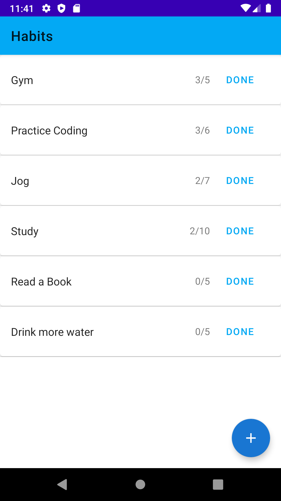

# Habits
Basic habit tracking app that allows the user to add habits/tasks they wish to accomplish and makes sure they stay on task. These ahbits can be done daily/weekly/monthly.

## Libraries
- Room: stored habits in a local Room database.
- Material Components: used material components to allow for cleaner UI and transistions.
- Dagger: inject dependecies instead of creating them in the class.

## Architecture
The code is designed using MVVM. The benefit of MVVM in this case is to allow the view to update whenever the habits list is changed behind the scenes.

## Future Updates
I hope to add the following features in the coming weeks:
- Calendar to show how many days each task was completed and how consistant the user is
- Improved UI and better design
- Remote database(possibly Firebase or MongoDb), if needed will use RxJava and Retrofit to fetch and post.
- Follow TDD and write tests using Mockito

## Demo
View the demo video in the main directory of the repo for a demo!!

